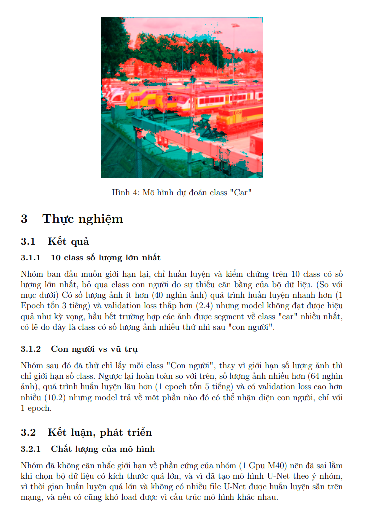
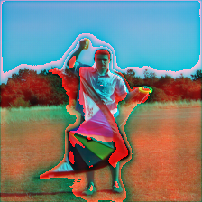

# 20120070 - Huynh Thiet Gia - HCMUS
# Image Segmentation Project
Junior (3rd year) uni project about retraining a U-Net model from sratch with COCO dataset, the report pdf can be found [here](./Report/DoHoa_Baocao_Group3.pdf) (Or alternatively, the pdf file in the "Report" folder).  
## Overview:
Snapshot of pdf file:  
  
Demo image for "Human" segmentation:  

